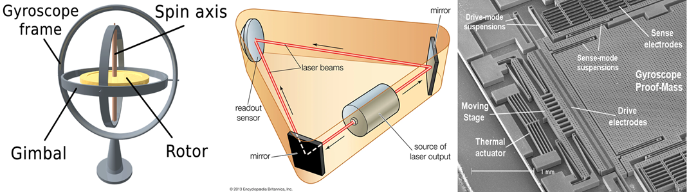

**Round 1**  
  
1. **IMU Data visualizer** (imu_projects/raw_imu_viewer)  
    a. Uses OpenGL and Qt to display 2D graphs of accelerometer and gyro data and 3D point data of magnetometer data.  
    b. Many subprojects were used for practice. The final project is a combination of them.  
        a. **Raw Accelerometer Data** (imu_projects/raw_accel_viewer)  
            a. Uses Qt and OpenGL to display a graph of accelerometer data in the X, Y, and Z axes.  
        b. **Raw Magnetometer Viewer** (imu_projects/raw_magnetometer_data)  
            a. Uses Qt and OpenGL to display a 3D graph of magnetometer data in the X, Y, and Z axes  
  
2. **PID tuner** (romi_robot/pid_tuner)  
    a. Uses OpenGL and Qt to help the user tune my robot's PIDs, and calculate the ideal values for optimal performance.  
  
3. **Motion Commands** (romi_robot/velocity_pid_test)  
    a. Uses a command line interface to make the robot perform a sequence of actions (eg. set the left wheel to speed X and right wheel to Y for Z seconds, etc.)  
  
4. **Romi Robot Controller Demo** (romi_robot/romi_robot_with_controller)  
    a. Control the two-wheeled robot with conventional joystick mechanics - like a video game or toy car - over bluetooth.  
        a. Uses a standard Bluetooth controller, in my case, an XBox controller.  