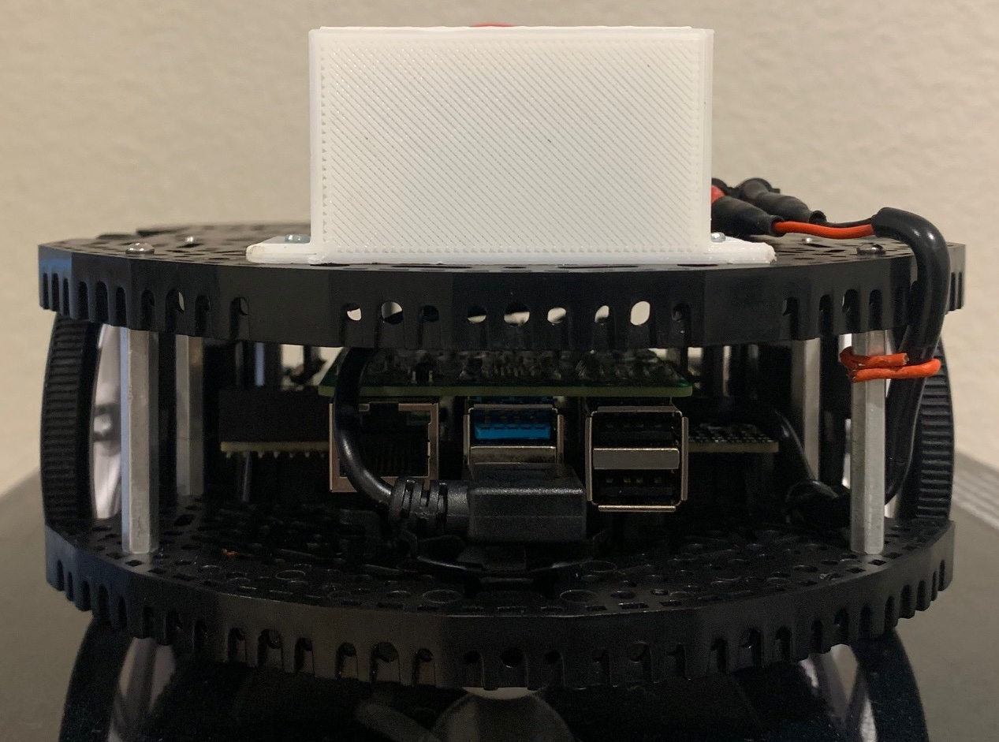
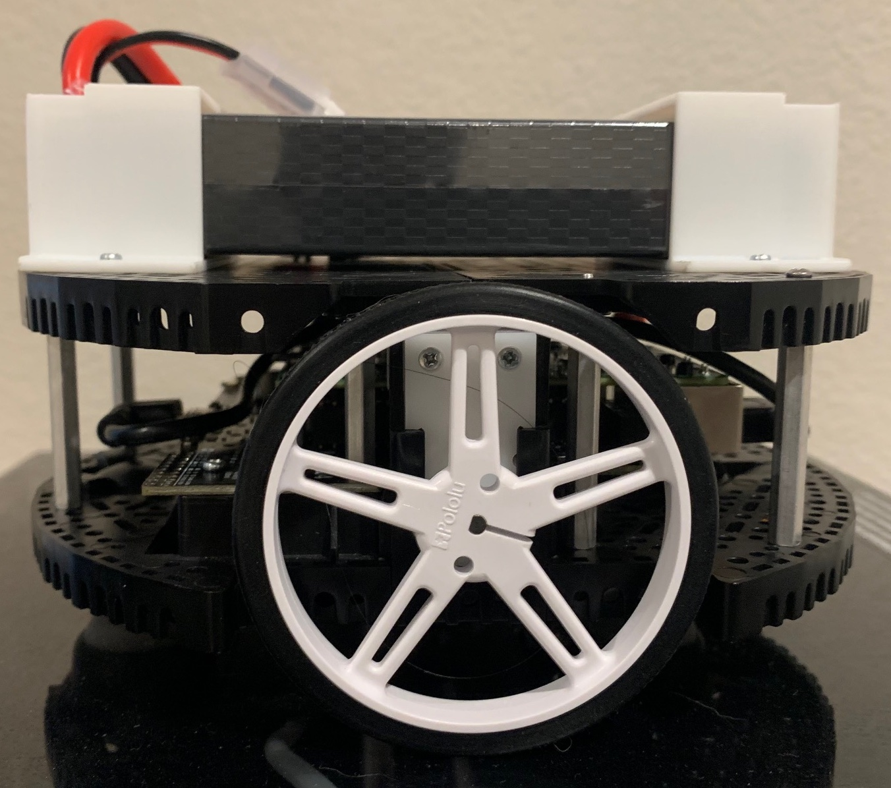
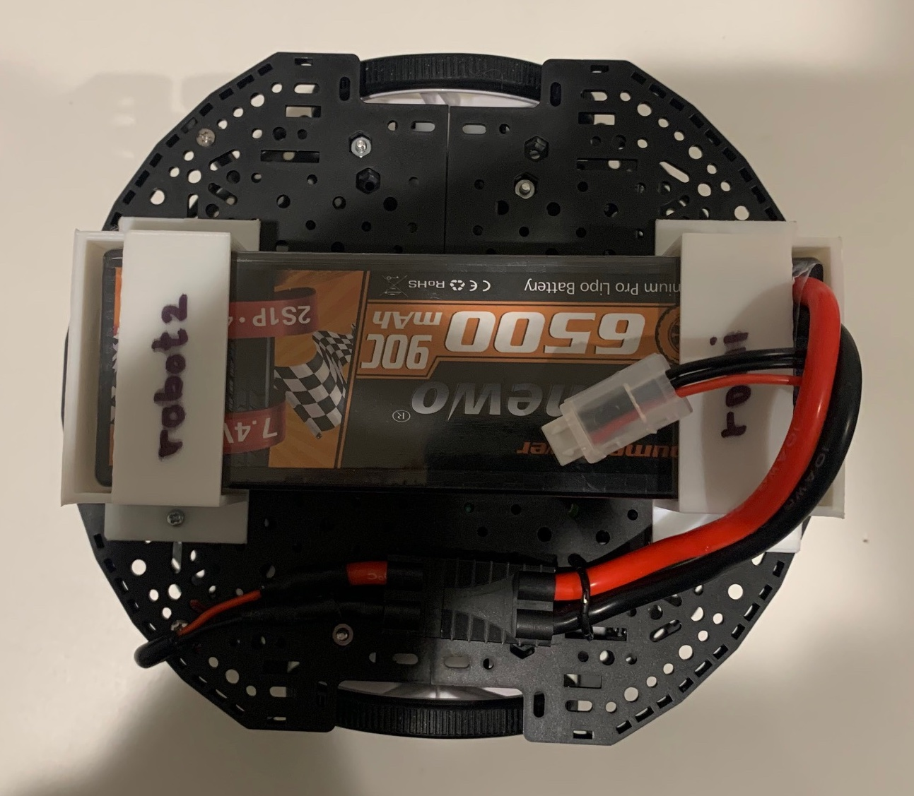
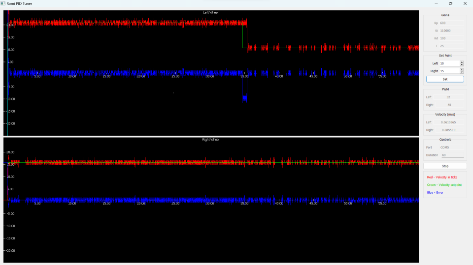

  
  

(Above, my particular robot)  
**What is the Romi Robot?**  
    The Polulu Romi Robot, which I will refer to as the Romi Robot, is a simple, 2-wheeled robot. It can be powered from a set of 4-6
AA batteries (which is the recommended manufacturer method), however, there is support to modify the robot to accept a 2S (7.4 volt) rechargable LiPo(Lithium-Polymer) battery (the kind used in hobbyist RC cars and drones). I chose to modify the robot to accept this new LiPo battery as the AA batteries were cumbersome to install and needed frequent charging. I ended up having to install a 3D-printed battery mount, which I made using my Creality K1 3D printer. This mount dramatically increased the ease of use of the robot, as it kept the battery securely attached AND was easily removable with a standard screwdriver.  
    The robot features two brushed DC motors (which are commonplace in various applications due to their simplicity) and it is 
controlled by a Pololu A-Star 32U4 (based on a popular ATMega 32U4 microcontroller). This microcontroller is connected to to the motors, and can issue commands to them. However, due to being a microcontroller, it lacks many critical features, like significant processing power, Bluetooth and Wifi connectivity, and the advantages of a familiar Linux programming environment (such as easy programming (microcontroller programming lacks many features)).
    To supplement the microcontroller, and perform more computationally complex and advanced tasks, a Raspberry Pi is connected to the 
microcontroller. The Raspberry Pi is a SBC(single board computer) that is the size of a credit-card. While it may be small, it still packs a significant amount of features, even being able to be connected to a monitor, keyboard, and mouse and used like a normal desktop with the included Raspbian OS (being a tiny device, it cannot run Windows, but it runs a version of Linux with basic productivity features (like a file manager, full browser, and Python/C/C++ programming suite)). As a result, most of the code that will run on a standard Windows laptop will run on the Pi, which was helpful as I prefer to program in Windows.  
  
(the green PCB is the Raspberry Pi and the other PCB is the 32U4)  
    In all of my projects, the Pi first recieves a set of commands (a .txt file, user input, or a Bluetooth joystick), does some 
calculations (breaking it down into a simple set of very basic movement commands (do X for Y time units)), and sends these simplified movement commands to the microcontoller, removing the heavy lifting from the microcontroller. A good analogy would be an architect converting a complex architectural diagram to basic instructions (eg. Put this screw in this place).  

  
(an example of a critical real-time system)  
**Why use the microcontroller instead of directly connecting the Pi to the motors?**  
    First of all, it is impossible to connect the Pi directly to the motors, as they are physically connected to the microcontroller
and connecting them to the Pi would be impossible. Also, one major flaw with directly connecting the Raspberry Pi to the motors is its lack of realtime support. Most computers, such as the Pi, use something called a scheduler. A good analogy that describes the scheduler is a juggler switching between many tasks. The computer is never idle, it might handle some display tasks for 2 milliseconds, quickly switch to an OS routine for file access, then switch to a random program, then your program, and then on and on. While this scheduler allows for dramatically simplified coding, a major flaw with it is that this switching can lead to odd delays when trying to perform time-sensitive tasks. For example, if you need to set a motors "throttle" signal (equivalent to the accelerator in a car) every 25 ms, the scheduler could be switching between different tasks (or even getting briefly stuck on one), and as a result, the computer could "skip" a task. The consequences of this could range from mundane (nothing major happens) to catastrophic (a plane's fly-by-wire system suddenly gets stuck on a background task, causing the critical flight control software to malfunction and cause the plane to flip tail-first at supersonic speeds and break up). While this "scheduler" has near-negligible effects on the actual computation/coding (it doesn't decrease the program's net speed by any significant amount), for tasks that are time-sensitive with very short time periods (you HAVE to perform action X within 25ms of the order), the computer would not be perfect. Microcontrollers, which either run no OS (they run the code directly on their tiny CPU without ANY background tasks to worry about) or have a special OS called a Real-Time Operating System (RTOS) (they set deadlines to accomplish actions and switch between tasks in a way that guarantees they will complete all of their actions by the deadlines). By having the Pi do computationally-intensive, less time-critical tasks (maybe updating every 50ms instead of 20ms) and sending its output to the microcontroller, I create a more reliable robot.  
  
**Detailed description of the Pi-Microcontroller communication**  
    The microcontroller and the Pi communicate over serial. Serial, which is a communication protocol dating back to the 1970s, is a
simple communication protocol where information is sent one character at a time. Imagine it as a tunnel where only one car can enter/leave at a time (despite this, it is not slow when you can get the car through very quickly (at the speed of light)). Serial communication in my project is done over a USB cable. This is an improvement over earlier iterations of the robot which used unreliable I2C communication (I will not elaborate on what I2C is here), which was more unreliable and prone to random disconnection. It also has severe limitations with bidirectional communication (the Pi had to ASK the microcontroller for information, instead of the microcontroller simply sending information). A description of the information sent is below:  

Pi->Microcontroller -> The Pi sends velocity setpoints and duration whenever it wants to (eg. in my controller program I update every 30ms), telling it to set each wheel to a certain velocity for a certain amount of time.  
Microcontroller->Pi -> The microcontroller tells the Pi about the motor "throttle" strength, the ACTUAL motor velocity (it is never perfect, there is a little bit of fluctuation), it's busy status (is it too busy with commands to accept a new one), and more information.

**What does the Microcontroller do?**  
    The microcontroller runs a firmware developed using the Arduino IDE and Arduino language. It is based off C/C++, but has some 
custom tweaks to make it run better on microcontrollers. Compared to regular C/C++, it is missing many features (like resizable vectors). The Arduino's task is to wait for commands, and upon recieving them, send its status (wheel velocity, wheel "throttle", time units (or ticks), busyness (can it accept more commands?), and more). Also, as a safety precaution, it will stop if disconnected. (it recives a "heartbeat" signal from the Pi, telling that it is listening).  

**Romi Robot projects**  
Here is a comprehensive description of my Romi Robot projects.
  
1. **PID tuner** (romi_robot/pid_tuner)
    a. Uses OpenGL and Qt to help the user tune my robot's PIDs, and calculate the ideal values for optimal performance.  
  
2. **Motion Commands** (romi_robot/velocity_pid_test)
    a. Uses a command line interface to make the robot perform a sequence of actions (eg. set the left wheel to speed X and right wheel to Y for Z seconds, etc.)  
  
3. **Romi Robot Controller Demo** (romi_robot/romi_robot_with_controller)
    a. Control the two-wheeled robot with conventional joystick mechanics - like a video game or toy car - over bluetooth.
        a. Uses a standard Bluetooth controller, in my case, an XBox controller.

**What is graph_image?**  
    Graph_image is a simple library I have included to help me with my code. Graph_image generates a 2D graph and its' axes and numbers
(used to display 2D graphs). This simplifies things for me as I do not have to reimplement the code from scratch each time I want to draw a 2D graph.

**Is it cross-platform?**  
    The code is cross-platform (tested on Linux (Raspbian) and Windows). It should be able to run on any platform, however, the 
intended platform is a Raspberry Pi or similiar SBC.